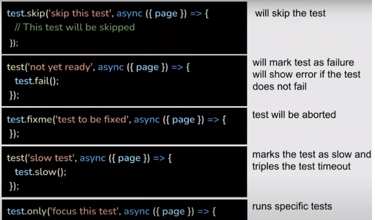

# Playwright


* [Qué es Playwright](#Playwright)
* [Instalación](#Instalación)
* [Creando nuestro primer test](#3)
* [Que queremos probar…](#4)
* [Trace viewer](#5)
* [¿Cómo encontrar objetos web?](#6)
* [Assertions](#7)
* [Grabar videos y cámara lenta](#8)
* [Hooks](#9)
* [Anotaciones](#10)
* [Etiquetas](#11)


<br>
<br>

# 1
# ¿Qué es playwright?
 1. Es un framework gratis y open source creado por microsoft para automatizar el testing web

 2. Soporta chromium, webkit y firefox

 3. Tiene una fácil preparación e instalación, además de unos test accesibles 

 4. Puede generar reportes automáticos, o a medida

 5. Compatible con Docker

 6. Puedes grabar y documentar tus test

 7. Puedes hacer test paralelos en distintos navegadores a la vez

 8. Usa shadow dom

 9. En distintos dispositivos y viewports 

 10. Test parametrizados


<br>

# 2
# Instalación
##### (Paso a paso y sin perdernos lo prometo)

<br>

## Requisitos:

* Node JS
* VS Code

### Instalación:

Instalación por comandos (npm). En cualquier carpeta

``` bash
npm init -y playwright@latest
```

Con este comando nos preguntará un par de cosas, las mas importantes son lenguaje y nombre de la carpeta, las demás podemos omitirlas con sus valores por defecto pulsando enter

<br/>
<div align="center">

### :exclamation: ADVERTENCIA :exclamation:
#### Nos fijamos siempre en el verbose del comando
</div>
<br/>


La configuración está en playwright.config.js
En la carpeta 'test', tenemos un ejemplo básico ya hecho ‘example.specs.js’
Se añade automáticamente al gitignore para que no tengamos que preocuparnos al subirlo a github 

``` bash
npm playwright -v
# Comprobamos si está bien instalado

npx playwright -h 
# Para una ver una ayuda
```

<br/><br/>


## Como ejecutar los test

``` bash
npx playwright test
```
(busca todos los .specs. Y los ejecuta)
Te generará un reporte en html en la carpeta :open_file_folder: playwright-report :open_file_folder:

``` bash
npx playwright test –-workers 3 
#Te hará los test para 3 navegadores diferentes
```

``` bash
npx playwright test -–proyect=chromiun
#Para una tecnología específica
```

``` bash
npx playwright test -–headed
#Sin interfaz, consume mucho menos recursos
```

``` bash
npx playwright test -–debug
#Para debuggear el test (archivo:linea)
```


<br/>
<br/>


# 3
# ¡Creando nuestro primer test! :smirk:


En la carpeta :open_file_folder: test :open_file_folder: nos creamos otro archivo de test (ex.specs.js)
Añadimos el módulo de test de playwright 

``` JS
const {test, expect} = require(‘@playwriht/test’)

//Dependiendo de si usamos los módulos de ES

import {test, expect} from '@playwriht/test'
```

<br/>

Hacemos las siguientes funciones de prueba (2 maneras distintas de exportar): 
```JS
exports.hello = function f1(){
    return 'hello'
}

export const helloWorld = () =>{
    return 'hello world'
}
```

<br/>

Las añadimos al fichero donde estamos haciendo las pruebas y las funciones necesarias paar hacer las pruebas

(A partir de aquí seguiré la sintasis sin modulos de ES)
```JS
const {test, expect} = require('@playwriht/test')
const {hello, helloWorld} = require('./demo/hello')
```

 * Creamos un bloque de test con la funcion 'test()'
    * Tiene que ser asíncrona
    * El primer parametro es el nombre del test
    * El segundo es un callback, al cual le pasamos 'page' desectructurado (esta será la página a la que vayamos)
    * expect() es una funcion que comprueba que el parámetro de entrada sea el mismo que el de salida

```JS
test('My First Test', async ({page}) => {
    await page.goto('https://google.com')
    await expect(page).toHaveTitle('Google')
})
```


<br/>

## ¿Hacer test sin saber hacer test? Por supuesto

Efectivamente, aparte de los reportes, la velocidad, el soporte y las distintas operaciones en paralelo con distintos navegadores, playwright también nos permite grabar nuestros test. Una idea bastante original y cercana a la experiencia de usuario, fácil de ver y asimilar, Porque estas pruebas las haremos en directo interactuando con la página

Para ello solo tenemos que ejecutar: 
```bash
npx playwright codegen # --help para ver todos los comandos
```

Por defecto nos abre en una pagina vacia y el inspector de playwright, en la URL tendremos que poner nuestra pagina
Y poniendo el ratón sobre los elemento podremos ver la magia e iremos interactuando con la pagina con el inspector abierto y veremos como genera automáticamente los test
Cuando queramos le damos al boton de grabar para que pare, podemos copiar los test,
Y en el target podemos exportarlo a cualquier lenguaje de los seleccionados

```bash
npx playwright codegen –target javascript -o .\test\donde lo pondremos.specs.js
# Guarda automáticamente en el archivo los test generados
```


# 4

# Que queremos probar…

 * Que queremos probar en distintos viewports? Pues…
```bash
npx playwright codegen –viewport-size=800,600 
```

 * Que queremos probar en un modelo especifico? Pues…
```bash
npx playwright codegen –device=”iPhone 11” 
# Los modelos que soporta son los de las devtools de inspeccionar, si pones alguno mal o que no exista, te muestra todos los disponibles
```

 * Que queremos probar el modo oscuro? Pues…
```bash
npx playwright codegen –color-scheme=dark
# O light 
# Probar npx playwright codegen –color-scheme=dark playwright.dev
```

<br/>
<br/>

# 5
# Usando trace viewer

El trace viewer es una herramienta GUI que nos ayuda pudiendo visualizar test a lo largo del proceso con capturas, incluye linea de tiempo y otros detalles.

 * Acciones
    * Antes y después
 * Metadatos
 * Llamadas
 * Consola
 * Network
 * Recursos
 * Interacción de clicks…

Básicamente podremos ver el estado de nuestra aplicación en cada punto de la misma


1 -	Abrir la configuración (playwright.config.js ) y poner     
```JS
// dentro del use{}
trace: ‘on-first-retry’

/* Retry on CI only*/
// retries: process.env.CI ? 2 : 0,
retries : 1,
```

Significa que recolecta el trace cuando intentamos fallar el test solo la 1era vez
Así que usaremos un test grabado y cambiaremos algo para que falle y ejecutamos el test

Si tarda mucho cambiamos el timeout

Ejecutamos y esperamos. Abajo del todo saldrá el trace, el cual puedes descargar

Al hacer click en él nos saldrá algo como esto

<br/>

Podremos ver muchos datos, :mag: EXPLORA :mag_right:

<br/>

También podremos acceder por comandos con npx playwright show-trace trace.zip
 


## Opciones del trace viewer
 * ‘On-first-retry’ → graba la traza solo después de fallar por primera vez
 * ’Off’		→ ¿Quién quiere grabar?
 * ‘On’		→ Graba por cada test (pesa mucho no recomendado)
 * ‘Retain-on-failure’ → (Graba por cada test pero borra los exitosos)


Para settear el trace desde comandos …
```bash
npx playwright test –trace on 
npx playwright show-trace trace.zip
```


# 6
# ¿Cómo encontrar objetos web?
```JS
//Añadimos al test antes de todo
test('blablabla', async ({page})=>{
    await page.pause()
    ...
})
```
Presionad el botón de explorar para ver todos los objetos web

 * Referencias para ampliar
    * https://playwright.dev/docs/api/class-selectors
    * https://playwright.dev/docs/api/class-locator


<br/>
<br/>

# 7
# Assertions
## Comprueba o verifica
### Comprueba si actual = esperado

 EJ: está o no presente, visible o invisible disponible o no, coindice el test, atributo de elemento, url…

```JS
test('Asertion demo', async ({page})=>{
    await page.goto('hhtps://kitchen.applitools.com')
    await page.pause()

    //ASERTIONS
    //Check if the element is present or not
    await expect(page.locator('text=The Kitchen')).toHaveCount(1)

    if( await page.$('text=The Kitchen')) await page.locator('text=The Kitchen').click()

    // Check element hidden or visible
    await expect(page.locator('text=The Kitchen')).toBeVisible()
    await expect.soft((page.locator('text=The Kitchen')).toBeHidden())
})
// Con la funcion 'soft()' Aunque falle el test no se detiene

// Check attribute value
    await expect(page.locator('text=The Kitchen')).toHaveAttribute('class', /.*css-dpmy2a/)
```


<br/>
<br/>

# 8
# Grabar videos y cámara lenta

En el playwright.config.js 
* Antes:
```JS
use:{
           I
   // Maximum time each action such as `cl...
   actionTimeout: 0,
   // Base URL to use in actions like `awa:...
   // baseURL: hhttp://localhost:30001,...
   // Collect trace when retrying the fail...
   trace: 'on-first-retry',
}
``` 

* Después:
```JS
use:{
// Shared settings for all the projects...
  video: 'on',
  launchOptions:{
     slowMo: 1000
// Maximum time each action such as...
  actionTimeout: 0,
// Base URL to use in actions like `aw...
// baseURL: 'http://localhost:30001,...
    }
}
``` 
Guardamos ejecutamos y abrimos el reporte, abajo del todo deberá aparecer nuestro video


# 9
# Hooks

 * Hooks : 
	* test.beforeAll → antes de todos
	* test.beforeEach → antes de cada uno
	* test.afterAll → después de todos
	* test.afterEach → después de cada uno

 * Groups :
    * Describe() → agrupa los test

```JS
test.describe(‘All my test’, ()=>{
	test(‘test1’, ()=>{})
	test(‘test2’, ()=>{})
	test(‘test3’, ()=>{})
	test(‘test4’, ()=>{})
})
```


<br/>
<br/>

# 10
# Anotaciones
 ## Ejemplo : 
 * test
    * .skip()
    * .fail()
    * .fixme()
    * .slow()
    * .only()



<br/>
<br/>

# 11
# Tags: 
    * @smoke
    * @reg
    * @sanity
    * @fast
    * @slow

Las tags sirven para identrificar y distinguir nuestros test, estas se usan en el nombre de los test ejemplo: 
```JS
test('Test Full Report @smoke', async({page})=>{
    ...
})
```

### Para ejecutar un test con tag en específico
```bash
npx playwriting –grep “@smoke”  # En el caso del ejemplo 
npx playwright test --grep-invert @slow # Todos menos el @slow
```


