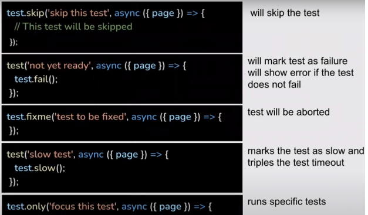

# Playwright


* [What is Playwright](#Playwright)
* [Installation](#Installation)
* [Creating our first test](#3)
* [What we want to test...](#4)
* [Trace viewer](#5)
* [How to find web objects](#6)
* [Assertions](#7)
* [Record videos and slow motion](#8)
* [Hooks](#9)
* [Annotations](#10)
* [Tags](#11)

<br>
<br>

# 1
# What is playwright?
 1. It is a free and open source framework created by microsoft to automate web testing.

 2. It supports chromium, webkit and firefox.

 3. It has an easy setup and installation, as well as accessible testing. 

 4. It can generate automatic reports, or custom reports.

 5. Compatible with Docker

 6. You can record and document your tests

 7. You can run parallel tests in different browsers at the same time.

 8. Use shadow dom

 9. On different devices and viewports 

 10. Parameterized tests


<br>

# 2
# Installation
##### (Step by step and without getting lost I promise)

<br>

## Requirements:

* Node JS
* VS Code

### Installation:

Installation by commands (npm). In any folder
``` bash
npm init -y playwright@latest
```

With this command we will be asked a couple of things, the most important are language and folder name, the others we can omit them with their default values by pressing enter.

<br/>
<div align="center">

### :exclamation: WARNING :exclamation:
#### We always pay attention to the verbose of the command
</div>
<br/>


The configuration is in playwright.config.js
In the 'test' folder, we have a basic example already made 'example.specs.js'.
It's automatically added to the gitignore so we don't have to worry about uploading it to github

``` bash
npm playwright -v
# Comprobamos si está bien instalado

npx playwright -h 
# Para una ver una ayuda
```

<br/><br/>


## How to run the tests

``` bash
npx playwright test
```
(busca todos los .specs. Y los ejecuta)
Te generará un reporte en html en la carpeta :open_file_folder: playwright-report :open_file_folder:

``` bash
npx playwright test –-workers 3 
#It will test you for 3 different browsers
```

``` bash
npx playwright test -–proyect=chromiun
#For a specific technology
```

``` bash
npx playwright test -–headed
#Without interface, it consumes much less resources
```

``` bash
npx playwright test -–debug
#To debug the test (file:line)
```


<br/>
<br/>


# 3
# Creating our first test! :smirk:


In the :open_file_folder: test :open_file_folder: folder, we create another test file (ex.specs.js).
We add the test module of playwright

``` JS
const {test, expect} = require(‘@playwriht/test’)

//Depending on whether we use the ES modules or not.

import {test, expect} from '@playwriht/test'
```

<br/>

We perform the following test functions (2 different ways of exporting):
```JS
exports.hello = function f1(){
    return 'hello'
}

export const helloWorld = () =>{
    return 'hello world'
}
```

<br/>

We add them to the file where we are making the tests and the necessary functions to make the tests.

(From here on I will follow the syntax without ES modules)
```JS
const {test, expect} = require('@playwriht/test')
const {hello, helloWorld} = require('./demo/hello')
```

* We create a test block with the function 'test()'.
    * It must be asynchronous
    * The first parameter is the name of the test.
    * The second is a callback, to which we pass an unstructured 'page' (this will be the page we are going to).
    * expect() is a function that checks that the input parameter is the same as the output parameter

```JS
test('My First Test', async ({page}) => {
    await page.goto('https://google.com')
    await expect(page).toHaveTitle('Google')
})
```


<br/>

## Doing tests without knowing how to do tests? Of course you can

Indeed, apart from reports, speed, support and different operations in parallel with different browsers, playwright also allows us to record our tests. A quite original idea and close to the user experience, easy to see and assimilate, because these tests will be done live interacting with the page.

To do this we just have to run:
```bash
npx playwright codegen # --help too see all the comands
```

By default it opens in an empty page and the inspector of playwright, in the URL we will have to put our page.
And putting the mouse over the elements we can see the magic and we will interact with the page with the inspector open and we will see how it automatically generates the tests.
When we want we give to the button of recording so that it stops, we can copy the tests,
And in the target we can export it to any of the selected languages.

```bash
npx playwright codegen –target javascript -o .\test\donde lo pondremos.specs.js
# Automatically saves generated tests to file
```


# 4

# What we want to prove...

 * What do we want to test in different viewports? Well...
```bash
npx playwright codegen –viewport-size=800,600 
```

 * What do we want to test on a specific model? Well...
```bash
npx playwright codegen –device=”iPhone 11” 
# The models supported are those of the inspection devtools, if you put any wrong or nonexistent model, it shows you all the available ones.
```

 * We want to try the dark mode? Well...
```bash
npx playwright codegen –color-scheme=dark
# Or light 
# npx playwright codegen -color-scheme=dark playwright.dev
```

<br/>
<br/>

# 5
# Using trace viewer

The trace viewer is a GUI tool that helps us to visualize tests along the process with snapshots, including timeline and other details.

* Actions
    * Before and after
 * Metadata
 * Callouts
 * Console
 * Network
 * Resources
 * Interaction of clicks...

Basically, we will be able to see the status of our application at each point of the application.

1 -	Open the configuration (playwright.config.js ) and put    
```JS
// in  use{}
trace: ‘on-first-retry’

/* Retry on CI only*/
// retries: process.env.CI ? 2 : 0,
retries : 1,
```

It means that it collects the trace when we try to fail the test only the 1st time.
So we will use a recorded test and change something to make it fail and run the test.

If it takes too long we change the timeout

We run and wait. At the bottom you will see the trace, which you can download.


<br/>

We will be able to see a lot of data, :mag: EXPLORE :mag_right:
<br/>

We can also access by command with npx playwright show-trace trace.zip 


## Trace viewer options
 * ‘On-first-retry’ → records the trace only after the first failure
 * ’Off’		→ Who wants to record?
 * ‘On’		→ Record for each test (heavy not recommended)
 * ‘Retain-on-failure’ → (records for each test but deletes the successful ones)


To set the trace from commands …
```bash
npx playwright test –trace on 
npx playwright show-trace trace.zip
```


# 6
# How to find web objects?
```JS
//We add to the test before everything
test('blablabla', async ({page})=>{
    await page.pause()
    ...
})
```
Click on the browse button to see all web objects.
* References to enlarge
    * https://playwright.dev/docs/api/class-selectors
    * https://playwright.dev/docs/api/class-locator


<br/>
<br/>

# 7
# Assertions
## Check or verify
### Check if actual = expected

EX: is present or not, visible or invisible, available or not, matches the test, element attribute, url...

```JS
test('Asertion demo', async ({page})=>{
    await page.goto('hhtps://kitchen.applitools.com')
    await page.pause()

    //ASERTIONS
    //Check if the element is present or not
    await expect(page.locator('text=The Kitchen')).toHaveCount(1)

    if( await page.$('text=The Kitchen')) await page.locator('text=The Kitchen').click()

    // Check element hidden or visible
    await expect(page.locator('text=The Kitchen')).toBeVisible()
    await expect.soft((page.locator('text=The Kitchen')).toBeHidden())
})
// Con la funcion 'soft()' Aunque falle el test no se detiene

// Check attribute value
    await expect(page.locator('text=The Kitchen')).toHaveAttribute('class', /.*css-dpmy2a/)
```


<br/>
<br/>

# 8
# Video recording and slow motion

In playwright.config.js 
* Before:
```JS
use:{
           I
   // Maximum time each action such as `cl...
   actionTimeout: 0,
   // Base URL to use in actions like `awa:...
   // baseURL: hhttp://localhost:30001,...
   // Collect trace when retrying the fail...
   trace: 'on-first-retry',
}
``` 

* After:
```JS
use:{
// Shared settings for all the projects...
  video: 'on',
  launchOptions:{
     slowMo: 1000
// Maximum time each action such as...
  actionTimeout: 0,
// Base URL to use in actions like `aw...
// baseURL: 'http://localhost:30001,...
    }
}
``` 
Save, run and open the report, our video should appear at the bottom.

# 9
# Hooks

 * Hooks : 
	* test.beforeAll 
	* test.beforeEach 
	* test.afterAll 
	* test.afterEach 

 * Groups :
    * Describe() → groups the tests

```JS
test.describe(‘All my test’, ()=>{
	test(‘test1’, ()=>{})
	test(‘test2’, ()=>{})
	test(‘test3’, ()=>{})
	test(‘test4’, ()=>{})
})
```


<br/>
<br/>

# 10
# Annotations
 ## Example : 
 * test
    * .skip()
    * .fail()
    * .fixme()
    * .slow()
    * .only()



<br/>
<br/>

# 11
# Tags: 
    * @smoke
    * @reg
    * @sanity
    * @fast
    * @slow

The tags are used to identify and distinguish our tests, they are used in the name of the example tests: 
```JS
test('Test Full Report @smoke', async({page})=>{
    ...
})
```

### To run a test with a specific tag
```bash
npx playwriting –grep “@smoke”  # In the case of the example
npx playwright test --grep-invert @slow # All except the @slow
```


